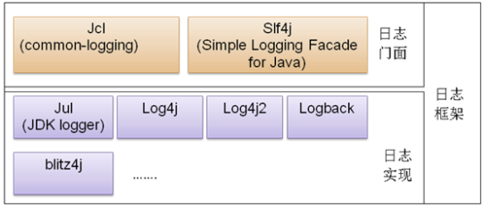

参考：https://blog.csdn.net/u012702547/article/details/111245762

##### 1.总体概览

    可以看到，Java 中的日志框架主要分为两大类：日志门面和日志实现。

    日志门面：日志门面定义了一组日志的接口规范，它并不提供底层具体的实现逻辑。Apache Commons Logging 和 Slf4j 就属于这一类。
    日志实现：日志实现则是日志具体的实现，包括日志级别控制、日志打印格式、日志输出形式（输出到数据库、输出到文件、输出到控制台等）。
    Log4j、Log4j2、Logback 以及 Java Util Logging 则属于这一类。
    
    
    将日志门面和日志实现分离其实是一种典型的门面模式，这种方式可以让具体业务在不同的日志实现框架之间自由切换，而不需要改动任何代码，开发者只需要掌握日志门面的 API 即可。
    日志门面是不能单独使用的，它必须和一种具体的日志实现框架相结合使用。
    那么日志框架是否可以单独使用呢？
    技术上来说当然没问题，但是我们一般不会这样做，因为这样做可维护性很差，而且后期扩展不易。
    例如 A 开发了一个工具包使用 Log4j 打印日志，B 引用了这个工具包，但是 B 喜欢使用 Logback 打印日志，此时就会出现一个业务使用两个甚至多个日志框架，开发者也需要维护多个日志的配置文件。
    因此我们都是用日志门面打印日志。

##### 2.springboot日志

    Spring Boot 使用 Apache Commons Logging 作为内部的日志框架门面，它只是一个日志接口，在实际应用中需要为该接口来指定相应的日志实现。
    Spring Boot 默认的日志实现是 Logback。
    其他的诸如 Java Util Logging、Log4j 等框架，Spring Boot 也有很好的支持。
    在 Spring Boot 项目中，只要添加了spring-boot-starter-web依赖，日志依赖就自动添加进来了。

##### 3.用log4j2替换logback
    
        <dependency>
            <groupId>org.springframework.boot</groupId>
            <artifactId>spring-boot-starter-web</artifactId>
            <exclusions>
                <exclusion>
                    <groupId>org.springframework.boot</groupId>
                    <artifactId>spring-boot-starter-logging</artifactId>
                </exclusion>
            </exclusions>
        </dependency>

        <dependency>
            <groupId>org.springframework.boot</groupId>
            <artifactId>spring-boot-starter-log4j2</artifactId>
        </dependency>

    log4j2.xml
    logs/ 目录